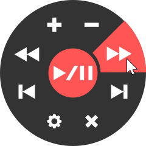

# YouTube Music Controller
A toggleable overlay with basic YouTube controls. Written in [AutoHotkey](https://autohotkey.com/).

## How to use
1. Download the version corresponding to your browser (more coming soon)
2. Open any YouTube playlist
3. Start YT Music Controller <BROWSER>.exe
4. Open the overlay by holding Mouse Button 3

## Some tips
- If you use YT Music Controller while gaming, make sure to play in "Borderless Windowed Mode".
- The browser window will be automatically hidden. To see it, uncheck "Hide window".
- You can change the hotkey in the key.ini file.

## License
This project is licensed under the MIT License - see the [LICENSE](LICENSE) file for details.
